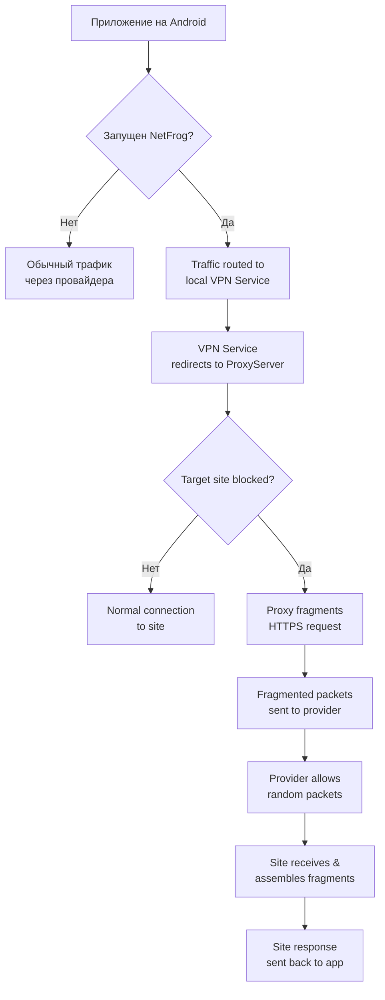

### Описание NetFrog: Приложения для Обхода Блокировок на Android

#### 🎯 Краткое описание

**NetFrog** — это гибридное Android-приложение, которое функционирует как прокси-сервер с функцией фрагментации трафика. Его основная цель — обход блокировок сайтов (например, на уровне интернет-провайдера или корпоративного firewall) путем маскировки HTTPS-трафика, делая его похожим на случайный или другой тип трафика.

Приложение состоит из двух основных частей:
1.  **Python-скрипт (`ProxyServer`):** Ядро прокси-сервера, которое работает в фоновом потоке и обрабатывает сетевой трафик.
2.  **Kotlin-активити (`MainActivity`):** Простой графический интерфейс для управления Python-скриптом через мост `chaquopy`.

#### 📊 Основной функционал и принцип работы

1.  **Прокси-сервер (Локальный):**
    *   Приложение запускает на самом устройстве прокси-сервер на указанном порту (`8881`).
    *   Пользователь должен вручную настроить свой телефон или браузер на использование этого локального прокси (`localhost:8881`), либо приложение должно перенаправлять трафик через него (в данном коде эта часть отсутствует, подразумевается ручная настройка).

2.  **Обход блокировок через фрагментацию (Fragmentation):**
    *   Это **ключевая особенность** приложения.
    *   Когда прокси-сервер обнаруживает, что данные предназначены для заблокированного сайта (порт `443` - HTTPS), он не передает их напрямую.
    *   Вместо этого он разбивает (**фрагментирует**) исходящие HTTPS-данные на множество маленьких, беспорядочно сгенерированных пакетов, добавляя к ним случайные заголовки.
    *   Для сетевого фильтра это выглядит как случайный, неопознанный шум, а не как четкий запрос к заблокированному домену, что позволяет трафику пройти.
    *   На стороне получателя (целевого сервера) эти пакеты должны быть собраны обратно. В данном коде эта логика не реализована, подразумевается, что сервер получает "кашу" из пакетов и сам ее обрабатывает.

3.  **Блокировка сайтов:**
    *   Приложение может работать и в обратную сторону — как персональный файрвол. Можно задать список `blocked_sites`.
    *   Если данные для запроса содержат URL из черного списка, они будут заблокированы прямо на устройстве.

#### 🛠 Техническая реализация

**Часть 1: Python-скрипт (`ProxyServer`)**

*   **Библиотеки:** `asyncio` для асинхронной обработки множества сетевых подключений.
*   **Методы:**
    *   `set_blocked_sites(sites)`: Задает черный список сайтов для блокировки.
    *   `fragment_data()`: Ядро системы обхода. Разбивает данные на случайные части.
    *   `handle_connection()`: Обрабатывает входящие HTTP-запросы по методу `CONNECT` (используется для прокси).
    *   `start()`/`stop()`: Запускает и останавливает сервер в фоновом потоке.

**Часть 2: Kotlin-код (`MainActivity`)**

*   **Chaquopy:** Мост между Java/Kotlin и Python. Позволяет запускать Python-код прямо внутри Android-приложения, что избавляет от необходимости подключать внешние серверы.
*   **Логика:**
    *   `initPython()`: Инициализирует интерпретатор Python внутри приложения.
    *   `runPythonScript(action)`: Вызывает методы `start()` или `stop()` у экземпляра `ProxyServer`, созданного в Python.
    *   **Важно:** В текущей реализации код запускает прокси, но **не перенаправляет через него весь трафик устройства**. Для этого требуется реализация VPN-сервиса (как намекает имя пакета `com.example.netfrog` и импорт `VpnService`).

#### ⚠️ Важные замечания и ограничения

1.  **Незавершенный VPN-функционал:** Код импортирует `VpnService`, но не использует его. Чтобы приложение автоматически перенаправляло трафик через свой прокси, а не требовало ручной настройки, необходимо реализовать `VpnService`, который будет захватывать трафик и направлять его на `localhost:8881`.

2.  **Односторонняя фрагментация:** Алгоритм фрагментации лишь отправляет данные обрывками. В коде нет реализации "сборки" входящего фрагментированного трафика от сервера. Это может привести к неработоспособности соединения.

3.  **Протоколы:** Скрипт работает только с HTTP-методом `CONNECT`, который используется для туннелирования HTTPS-трафика через прокси. Прямые HTTP-запросы он игнорирует.

4.  **Безопасность:** Данные передаются в открытом виде внутри устройства до момента фрагментации. Это не инструмент для шифрования или обеспечения конфиденциальности, а лишь для обхода блокировок.

5.  **Стабильность:** Использование случайных значений в заголовках пакетов (`bytes.fromhex("1603") + bytes([random.randint(0, 255)])`) может вызывать ошибки на стороне сервера или сетевого оборудования, которое ожидает строго определенные форматы.

#### 🔄 Как это должно работать (Идеальная схема)

---

**Итог:** Данный код представляет собой интересный, но сырой и незавершенный PoC (Proof of Concept) для обхода сетевых ограничений на Android. Его основная ценность — в демонстрации идеи использования фрагментации трафика и интеграции Python-логики в мобильное приложение с помощью Chaquopy. Для полноценной работы ему необходима реализация VPN-сервиса и доработка механизма фрагментации/сборки.
